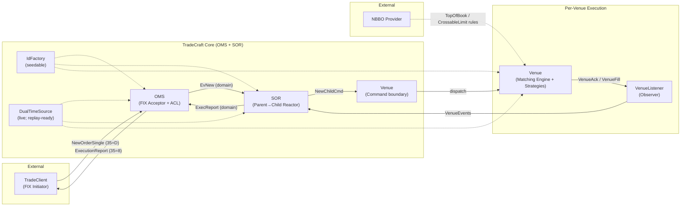
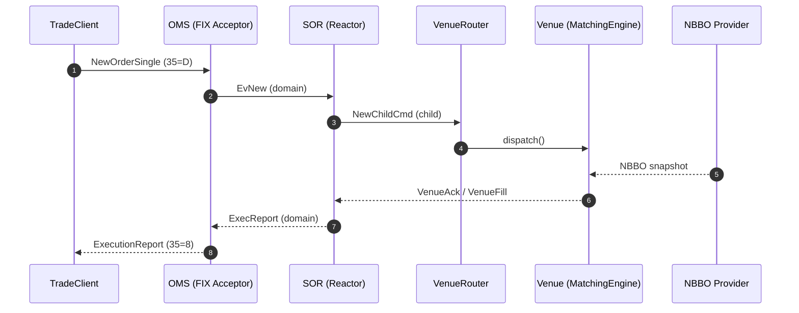

# TradeCraft – OMS + SOR + Venue Simulator + TradeClient Demo

> **Release Tier-1 (2025-11-02)**
> MatchingEngine + NBBO + IdFactory + DualTimeSource
> **Version:** 1.0.1-SNAPSHOT – preparing Tier-1.1 (Replay + Latency)

TradeCraft simulates a deterministic trading stack — OMS → SOR → Venue — built in Java 21 with QuickFIX/J.
It demonstrates how FIX messages travel from a Trader client through order routing and into a matching engine.

---

## 🚀 MVP-Tier-1 Features

* **FIX 4.4 connectivity** via QuickFIX/J
  Acceptor & Initiator with config files: `quickfix/acceptor.cfg`, `quickfix/initiator.cfg`.

* **Parent/Child order model** with FSM lifecycle
  `NEW → ACK → FILL`, handled by the **SOR** parent/child intent handlers.

* **Venue execution pipeline**

    * `FatFingerRiskStrategy` — price-band guard
    * `ImmediateFillStrategy` with NBBO-aware rules
        * `TopOfBookRule` (uses `NbboProvider`)
        * `CrossableLimitTopOfBookRule`
    * `MatchingEngine` (Price→FIFO)

  > Demo executes as **single full fills** (no partials yet)

* **DualTimeSource** — live clock today; replay-ready hooks for next tier

* **IdFactory** — seeded, deterministic IDs (ParentId, ChildId, VenueOrderId, ExecId)

* **Demo trades** (`resources/trade-entry.csv`)

    * **Limit BUY** `LMT @ 199.5`
    * **Market BUY** `MKT`
    * **Limit SELL** `LMT @ 199.5`

---

## ❌ Not in MVP-1

* Cancel / Replace flows (`FIX 35=F/G`)
* Idempotency of duplicate FIX messages
* Complex order types (IOC, FOK, GTD)
* Production-grade risk checks or persistence

These are all candidates for **future extensions**.

---

## 📊 Architecture Overview



**Flow Summary**

1. **TradeClient** sends *NewOrderSingle (35=D)* → **OMS** (ACL) maps FIX → `EvNew`.
2. **SOR** converts to `NewChildCmd`; **VenueRouter** dispatches per-venue.
3. **Venue** applies strategies (`FatFinger`, `ImmediateFill`, `MatchingEngine`) using **NBBO** guardrails.
4. **VenueListener** emits Ack/Fill → **SOR → OMS → Trader** as ExecutionReport (35=8).
5. **IdFactory** ensures deterministic IDs; **DualTimeSource** stamps timestamps for future replay.



---

## 🧩 Demo Scenarios

| Scenario | Description             | Expected Outcome             |
| -------- | ----------------------- | ---------------------------- |
| A        | Limit BUY 1000 @ 199.5  | Rests on book                |
| B        | Limit SELL 1000 @ 199.5 | Matches BUY @ 199.5          |
| C        | Market BUY 1000         | Executes ≤ NBBO Ask (205.00) |

---

## 🧠 Design Patterns Summary

| Layer           | Pattern(s)                      | Purpose                              |
| --------------- | ------------------------------- | ------------------------------------ |
| OMS             | Pipeline, Anti-Corruption Layer | Transform FIX → domain events        |
| SOR             | Reactor, Command Envelope, CQRS | Deterministic Parent → Child routing |
| Venue           | Strategy, Actor, Observer       | Price-time matching and event stream |
| Matching Engine | Price→FIFO Book                 | Deterministic matching logic         |
| Infrastructure  | Factory, Deterministic Clock    | IdFactory + DualTimeSource           |
| Market Data     | Reactor, Observer               | NBBO integration for pricing rules   |

---

## 🔧 Build & Run

Requirements:

* Java 21+
* Gradle 8+ (wrapper included)

Compile & test:

```bash
./gradlew clean build
```

Run demo (use two terminals):

**Terminal 1 – OMS + Venue**

```bash
./gradlew runTradeCraft
```

**Terminal 2 – TradeClient**

```bash
./gradlew runTradeClient
```

The Trader automatically loads demo trades from `resources/trade-entry.csv`.

---

## 📊 Sample Output

*(Condensed flow across components; see full log for details)*

```text
# Sample Summary
NBBO at (195.0, 205.0)
1 Limit Buy of 1000@199.5
1 Market Buy of 1000
1 Limit Sell of 1000@199.5
```
---
## 📜 Logs & Trace References

- [TraderClient (Initiator)](#traderclient-logs)
- [OMS (Acceptor + Pipeline)](#oms-logs)
- [SOR (Parent/Child intents)](#sor-logs)
- [Venue (Matching + Acks/Fills)](#venue-logs)

> Tip: These are the exact logs produced by `runTradeClient` and `runTradeCraft` during the Tier-1 demo.

### How to regenerate logs
```bash
# Terminal 1 (OMS + SOR + Venue)
./gradlew runTradeCraft | tee oms_venue.log

# Terminal 2 (Trade Client)
./gradlew runTradeClient | tee trader.log
```

### TradeClient logs
<details>
<summary>Show TradeClient (FIX initiator) logs</summary>

```text
2025-11-02T18:41:00,575 FIX.4.4:TRADER->OMS: 8=FIX.4.4|9=70|35=A|34=1|49=TRADER|52=20251102-23:41:00.541|56=OMS|98=0|108=30|141=Y|10=204|
2025-11-02T18:41:00,589 FIX.4.4:TRADER->OMS: Initiated logon request
2025-11-02T18:41:00,673 FIX.4.4:TRADER->OMS: Logon contains ResetSeqNumFlag=Y, resetting sequence numbers to 1
2025-11-02T18:41:00,682 [TRADER][ADMIN][IN] TraderClient - TRADER<-OMS 8=FIX.4.4|9=70|35=A|34=1|49=OMS|52=20251102-23:41:00.626|56=TRADER|98=0|108=30|141=Y|10=208|
Loaded 3 trades.
2025-11-02T18:41:00,738 [TRADER][CMD][OUT] TraderApp - String NEW BUY AAPL x1000 (LMT@199.5000) acct=CLIENT123 (ClOrdID=)
2025-11-02T18:41:00,740 [TRADER][EV][OUT] TraderClient - TRADER->OMS 8=FIX.4.4|9=156|35=D|34=2|49=TRADER|52=20251102-23:41:00.739|56=OMS|1=CLIENT123|11=CL1|21=1|38=1000|40=2|44=199.5|54=1|55=AAPL|59=0|60=20251102-23:41:00.734|100=XNAS|581=1|10=000|
2025-11-02T18:41:00,740 FIX.4.4:TRADER->OMS: 8=FIX.4.4|9=156|35=D|34=2|49=TRADER|52=20251102-23:41:00.739|56=OMS|1=CLIENT123|11=CL1|21=1|38=1000|40=2|44=199.5|54=1|55=AAPL|59=0|60=20251102-23:41:00.734|100=XNAS|581=1|10=000|
2025-11-02T18:41:00,741 [TRADER][CMD][OUT] TraderApp - String NEW BUY AAPL x1000 (MKT) acct=CLIENT999 (ClOrdID=)
2025-11-02T18:41:00,742 [TRADER][EV][OUT] TraderClient - TRADER->OMS 8=FIX.4.4|9=147|35=D|34=3|49=TRADER|52=20251102-23:41:00.741|56=OMS|1=CLIENT999|11=CL2|21=1|38=1000|40=1|54=1|55=AAPL|59=0|60=20251102-23:41:00.741|100=XNAS|581=1|10=097|
2025-11-02T18:41:00,742 FIX.4.4:TRADER->OMS: 8=FIX.4.4|9=147|35=D|34=3|49=TRADER|52=20251102-23:41:00.741|56=OMS|1=CLIENT999|11=CL2|21=1|38=1000|40=1|54=1|55=AAPL|59=0|60=20251102-23:41:00.741|100=XNAS|581=1|10=097|
2025-11-02T18:41:00,743 [TRADER][CMD][OUT] TraderApp - String NEW SELL AAPL x1000 (LMT@199.5000) acct=CLIENT123 (ClOrdID=)
2025-11-02T18:41:00,743 [TRADER][EV][OUT] TraderClient - TRADER->OMS 8=FIX.4.4|9=156|35=D|34=4|49=TRADER|52=20251102-23:41:00.743|56=OMS|1=CLIENT123|11=CL3|21=1|38=1000|40=2|44=199.5|54=2|55=AAPL|59=0|60=20251102-23:41:00.742|100=XNAS|581=1|10=255|
2025-11-02T18:41:00,744 FIX.4.4:TRADER->OMS: 8=FIX.4.4|9=156|35=D|34=4|49=TRADER|52=20251102-23:41:00.743|56=OMS|1=CLIENT123|11=CL3|21=1|38=1000|40=2|44=199.5|54=2|55=AAPL|59=0|60=20251102-23:41:00.742|100=XNAS|581=1|10=255|
2025-11-02T18:41:01,038 [TRADER][EV][IN] TraderApp - ER clOrdId=CL1 ordId=CL1 secondaryClOrdId=OMS-dd1db1245ebd0f9c secondaryOrderId= execId=EX-ffbed83d67a845c78c9f95c430984da8 execType=0 ordStatus=0 last=0@- cum=0 leaves=1000 avgPx=0.0000 lastMkt= transactTime=2025-11-02T23:41:01.008
2025-11-02T18:41:01,039 [TRADER][EV][IN] TraderApp - ER clOrdId=CL2 ordId=CL2 secondaryClOrdId=OMS-4d4965eb05f755eb secondaryOrderId= execId=EX-5b500391b60c4d56b84af0507fee3272 execType=0 ordStatus=0 last=0@- cum=0 leaves=1000 avgPx=0.0000 lastMkt= transactTime=2025-11-02T23:41:01.010
2025-11-02T18:41:01,040 [TRADER][EV][IN] TraderApp - ER clOrdId=CL2 ordId=C-102653085befa023 secondaryClOrdId=OMS-4d4965eb05f755eb secondaryOrderId=C-102653085befa023 execId=EX-933b6d883b3c46e299a90db9ea46ad9e execType=2 ordStatus=2 last=1000@205.0000 cum=1000 leaves=0 avgPx=205.0000 lastMkt= transactTime=2025-11-02T23:41:01.012
2025-11-02T18:41:01,042 [TRADER][EV][IN] TraderApp - ER clOrdId=CL3 ordId=CL3 secondaryClOrdId=OMS-2c8a77b7e555d3ca secondaryOrderId= execId=EX-ea4c37db143a47368a798cd58b9577f9 execType=0 ordStatus=0 last=0@- cum=0 leaves=1000 avgPx=0.0000 lastMkt= transactTime=2025-11-02T23:41:01.014
2025-11-02T18:41:01,043 [TRADER][EV][IN] TraderApp - ER clOrdId=CL3 ordId=C-b8221d37bd081cf7 secondaryClOrdId=OMS-2c8a77b7e555d3ca secondaryOrderId=C-b8221d37bd081cf7 execId=EX-13753d9056b5484db178f8500d472f51 execType=2 ordStatus=2 last=1000@199.5000 cum=1000 leaves=0 avgPx=199.5000 lastMkt= transactTime=2025-11-02T23:41:01.016
2025-11-02T18:41:01,044 [TRADER][EV][IN] TraderApp - ER clOrdId=CL1 ordId=C-98452a8650d123d1 secondaryClOrdId=OMS-dd1db1245ebd0f9c secondaryOrderId=C-98452a8650d123d1 execId=EX-9b5e62c207fc4f83b0b347ebf629c84f execType=2 ordStatus=2 last=1000@199.5000 cum=1000 leaves=0 avgPx=199.5000 lastMkt= transactTime=2025-11-02T23:41:01.017```
```
</details>

### OMS logs
<details>
<summary>Show OMS (FIX acceptor + pipeline) logs</summary>

```text
2025-11-02T18:41:00,813 [OMS][EV][IN] Pipeline - EvBoundParentNew EvBoundParentNew[parentId=null, tsNanos=16928669240598, sessionKey=FIX.4.4:TRADER->OMS, clOrdId=CL1, accountId=CLIENT123, domainAccountType=CUSTOMER, instrumentKey=InstrumentKey[securityId=null, securityIdSource=UNKNOWN, symbol=AAPL, mic=XNAS], side=BUY, qty=1000, ordType=LIMIT, limitPxMicros=199500000, tif=DAY, exDest=XNAS]
2025-11-02T18:41:00,835 [OMS][EV][IN] Pipeline - EvNew EvNew[parentId=OMS-dd1db1245ebd0f9c, tsNanos=16928669240598, clOrdId=CL1, accountId=CLIENT123, accountType=CUSTOMER, instrumentKey=InstrumentKey[securityId=null, securityIdSource=UNKNOWN, symbol=AAPL, mic=XNAS], side=BUY, qty=1000, ordType=LIMIT, limitPxMicros=199500000, tif=DAY, exDest=XNAS]
2025-11-02T18:41:00,844 [OMS][EV][IN] Pipeline - EvBoundParentNew EvBoundParentNew[parentId=null, tsNanos=16928688095050, sessionKey=FIX.4.4:TRADER->OMS, clOrdId=CL2, accountId=CLIENT999, domainAccountType=CUSTOMER, instrumentKey=InstrumentKey[securityId=null, securityIdSource=UNKNOWN, symbol=AAPL, mic=XNAS], side=BUY, qty=1000, ordType=MARKET, limitPxMicros=0, tif=DAY, exDest=XNAS]
2025-11-02T18:41:00,845 [OMS][EV][IN] Pipeline - EvNew EvNew[parentId=OMS-4d4965eb05f755eb, tsNanos=16928688095050, clOrdId=CL2, accountId=CLIENT999, accountType=CUSTOMER, instrumentKey=InstrumentKey[securityId=null, securityIdSource=UNKNOWN, symbol=AAPL, mic=XNAS], side=BUY, qty=1000, ordType=MARKET, limitPxMicros=0, tif=DAY, exDest=XNAS]
2025-11-02T18:41:00,845 [OMS][EV][IN] Pipeline - EvBoundParentNew EvBoundParentNew[parentId=null, tsNanos=16928688539803, sessionKey=FIX.4.4:TRADER->OMS, clOrdId=CL3, accountId=CLIENT123, domainAccountType=CUSTOMER, instrumentKey=InstrumentKey[securityId=null, securityIdSource=UNKNOWN, symbol=AAPL, mic=XNAS], side=SELL, qty=1000, ordType=LIMIT, limitPxMicros=199500000, tif=DAY, exDest=XNAS]
2025-11-02T18:41:00,846 [OMS][EV][IN] Pipeline - EvNew EvNew[parentId=OMS-2c8a77b7e555d3ca, tsNanos=16928688539803, clOrdId=CL3, accountId=CLIENT123, accountType=CUSTOMER, instrumentKey=InstrumentKey[securityId=null, securityIdSource=UNKNOWN, symbol=AAPL, mic=XNAS], side=SELL, qty=1000, ordType=LIMIT, limitPxMicros=199500000, tif=DAY, exDest=XNAS]
2025-11-02T18:41:00,954 [OMS][EV][IN] Pipeline - EvChildAck EvChildAck[parentId=OMS-dd1db1245ebd0f9c, childId=C-98452a8650d123d1, childClOrdId=CC-bba56cd1dc3c92cb, venueId=VenueId[value=XNAS], venueOrderId=V-e320f30741d0b13a, execId=EX-ffbed83d67a845c78c9f95c430984da8, tif=null, expireAt=null, tsNanos=16928811014055]
2025-11-02T18:41:00,967 [OMS][EV][IN] Pipeline - EvChildAck EvChildAck[parentId=OMS-4d4965eb05f755eb, childId=C-102653085befa023, childClOrdId=CC-608358cb8451ad73, venueId=VenueId[value=XNAS], venueOrderId=V-f458ebb300a8dd79, execId=EX-5b500391b60c4d56b84af0507fee3272, tif=null, expireAt=null, tsNanos=16928843335901]
2025-11-02T18:41:00,990 [OMS][EV][IN] Pipeline - EvFill EvFill[parentId=OMS-4d4965eb05f755eb, tsNanos=16928844919406, childId=C-102653085befa023, childClOrdId=CC-608358cb8451ad73, venueId=VenueId[value=XNAS], venueOrderId=V-f458ebb300a8dd79, execId=EX-933b6d883b3c46e299a90db9ea46ad9e, lastQty=1000, lastPxMicros=205000000, cumQty=1000, leaveQty=0]
2025-11-02T18:41:00,990 [OMS][ER][IN] OutboundExecReportDrainer - PubExecReport PubExecReport[parentId=OMS-dd1db1245ebd0f9c, clOrdId=CL1, origClOrdId=null, childId=null, venueId=null, venueOrderId=null, execId=EX-ffbed83d67a845c78c9f95c430984da8, instrumentKey=InstrumentKey[securityId=null, securityIdSource=UNKNOWN, symbol=AAPL, mic=XNAS], domainSide=BUY, execKind=NEW, status=WORKING, lastQty=0, cumQty=0, leavesQty=1000, lastPxMicros=0, avgPxMicros=0, tsNanos=16928811014055, reason=]
2025-11-02T18:41:00,991 [OMS][EV][IN] Pipeline - EvChildAck EvChildAck[parentId=OMS-2c8a77b7e555d3ca, childId=C-b8221d37bd081cf7, childClOrdId=CC-c261c9d438a6b543, venueId=VenueId[value=XNAS], venueOrderId=V-1787e9f43562ada9, execId=EX-ea4c37db143a47368a798cd58b9577f9, tif=null, expireAt=null, tsNanos=16928877561970]
2025-11-02T18:41:00,992 [OMS][EV][IN] Pipeline - EvFill EvFill[parentId=OMS-2c8a77b7e555d3ca, tsNanos=16928877747289, childId=C-b8221d37bd081cf7, childClOrdId=CC-c261c9d438a6b543, venueId=VenueId[value=XNAS], venueOrderId=V-1787e9f43562ada9, execId=EX-13753d9056b5484db178f8500d472f51, lastQty=1000, lastPxMicros=199500000, cumQty=1000, leaveQty=0]
2025-11-02T18:41:00,992 [OMS][EV][IN] Pipeline - EvFill EvFill[parentId=OMS-dd1db1245ebd0f9c, tsNanos=16928877934683, childId=C-98452a8650d123d1, childClOrdId=CC-bba56cd1dc3c92cb, venueId=VenueId[value=XNAS], venueOrderId=V-e320f30741d0b13a, execId=EX-9b5e62c207fc4f83b0b347ebf629c84f, lastQty=1000, lastPxMicros=199500000, cumQty=1000, leaveQty=0]
2025-11-02T18:41:01,008 FIX.4.4:OMS->TRADER: 8=FIX.4.4|9=206|35=8|34=2|49=OMS|52=20251102-23:41:01.008|56=TRADER|6=0|11=CL1|14=0|17=EX-ffbed83d67a845c78c9f95c430984da8|37=CL1|39=0|54=1|55=AAPL|60=20251102-23:41:01.008|150=0|151=1000|207=XNAS|526=OMS-dd1db1245ebd0f9c|10=053|
2025-11-02T18:41:01,009 [OMS][ER][IN] OutboundExecReportDrainer - PubExecReport PubExecReport[parentId=OMS-4d4965eb05f755eb, clOrdId=CL2, origClOrdId=null, childId=null, venueId=null, venueOrderId=null, execId=EX-5b500391b60c4d56b84af0507fee3272, instrumentKey=InstrumentKey[securityId=null, securityIdSource=UNKNOWN, symbol=AAPL, mic=XNAS], domainSide=BUY, execKind=NEW, status=WORKING, lastQty=0, cumQty=0, leavesQty=1000, lastPxMicros=0, avgPxMicros=0, tsNanos=16928843335901, reason=]
2025-11-02T18:41:01,010 FIX.4.4:OMS->TRADER: 8=FIX.4.4|9=206|35=8|34=3|49=OMS|52=20251102-23:41:01.010|56=TRADER|6=0|11=CL2|14=0|17=EX-5b500391b60c4d56b84af0507fee3272|37=CL2|39=0|54=1|55=AAPL|60=20251102-23:41:01.010|150=0|151=1000|207=XNAS|526=OMS-4d4965eb05f755eb|10=239|
2025-11-02T18:41:01,011 [OMS][ER][IN] OutboundExecReportDrainer - PubExecReport PubExecReport[parentId=OMS-4d4965eb05f755eb, clOrdId=CL2, origClOrdId=null, childId=C-102653085befa023, venueId=null, venueOrderId=null, execId=EX-933b6d883b3c46e299a90db9ea46ad9e, instrumentKey=InstrumentKey[securityId=null, securityIdSource=UNKNOWN, symbol=AAPL, mic=XNAS], domainSide=BUY, execKind=FILL, status=FILLED, lastQty=1000, cumQty=1000, leavesQty=0, lastPxMicros=205000000, avgPxMicros=205000000, tsNanos=16928844919406, reason=]
2025-11-02T18:41:01,013 FIX.4.4:OMS->TRADER: 8=FIX.4.4|9=261|35=8|34=4|49=OMS|52=20251102-23:41:01.012|56=TRADER|6=205|11=CL2|14=1000|17=EX-933b6d883b3c46e299a90db9ea46ad9e|31=205|32=1000|37=C-102653085befa023|39=2|54=1|55=AAPL|60=20251102-23:41:01.012|150=2|151=0|198=C-102653085befa023|207=XNAS|526=OMS-4d4965eb05f755eb|10=141|
2025-11-02T18:41:01,013 [OMS][ER][IN] OutboundExecReportDrainer - PubExecReport PubExecReport[parentId=OMS-2c8a77b7e555d3ca, clOrdId=CL3, origClOrdId=null, childId=null, venueId=null, venueOrderId=null, execId=EX-ea4c37db143a47368a798cd58b9577f9, instrumentKey=InstrumentKey[securityId=null, securityIdSource=UNKNOWN, symbol=AAPL, mic=XNAS], domainSide=SELL, execKind=NEW, status=WORKING, lastQty=0, cumQty=0, leavesQty=1000, lastPxMicros=0, avgPxMicros=0, tsNanos=16928877561970, reason=]
2025-11-02T18:41:01,014 FIX.4.4:OMS->TRADER: 8=FIX.4.4|9=206|35=8|34=5|49=OMS|52=20251102-23:41:01.014|56=TRADER|6=0|11=CL3|14=0|17=EX-ea4c37db143a47368a798cd58b9577f9|37=CL3|39=0|54=2|55=AAPL|60=20251102-23:41:01.014|150=0|151=1000|207=XNAS|526=OMS-2c8a77b7e555d3ca|10=124|
2025-11-02T18:41:01,015 [OMS][ER][IN] OutboundExecReportDrainer - PubExecReport PubExecReport[parentId=OMS-2c8a77b7e555d3ca, clOrdId=CL3, origClOrdId=null, childId=C-b8221d37bd081cf7, venueId=null, venueOrderId=null, execId=EX-13753d9056b5484db178f8500d472f51, instrumentKey=InstrumentKey[securityId=null, securityIdSource=UNKNOWN, symbol=AAPL, mic=XNAS], domainSide=SELL, execKind=FILL, status=FILLED, lastQty=1000, cumQty=1000, leavesQty=0, lastPxMicros=199500000, avgPxMicros=199500000, tsNanos=16928877747289, reason=]
2025-11-02T18:41:01,016 FIX.4.4:OMS->TRADER: 8=FIX.4.4|9=265|35=8|34=6|49=OMS|52=20251102-23:41:01.016|56=TRADER|6=199.5|11=CL3|14=1000|17=EX-13753d9056b5484db178f8500d472f51|31=199.5|32=1000|37=C-b8221d37bd081cf7|39=2|54=2|55=AAPL|60=20251102-23:41:01.016|150=2|151=0|198=C-b8221d37bd081cf7|207=XNAS|526=OMS-2c8a77b7e555d3ca|10=078|
2025-11-02T18:41:01,017 [OMS][ER][IN] OutboundExecReportDrainer - PubExecReport PubExecReport[parentId=OMS-dd1db1245ebd0f9c, clOrdId=CL1, origClOrdId=null, childId=C-98452a8650d123d1, venueId=null, venueOrderId=null, execId=EX-9b5e62c207fc4f83b0b347ebf629c84f, instrumentKey=InstrumentKey[securityId=null, securityIdSource=UNKNOWN, symbol=AAPL, mic=XNAS], domainSide=BUY, execKind=FILL, status=FILLED, lastQty=1000, cumQty=1000, leavesQty=0, lastPxMicros=199500000, avgPxMicros=199500000, tsNanos=16928877934683, reason=]
```
</details>

### SOR logs
<details>
<summary>Show SOR (Parent/Child intent + VenueRouter interface) logs</summary>

```text
2025-11-02T18:41:00,864 [SOR][CMD][IN] DefaultParentIntentHandler - ParentRouteIntent ParentRouteIntent[parentId=OMS-dd1db1245ebd0f9c, clOrdId=CL1, accountId=CLIENT123, accountType=CUSTOMER, instrumentKey=InstrumentKey[securityId=null, securityIdSource=UNKNOWN, symbol=AAPL, mic=XNAS], side=BUY, parentQty=1000, leavesQty=1000, ordType=LIMIT, limitPxMicros=199500000, tif=DAY, expireAt=1969-12-31T21:00:00Z, exDest=XNAS, candidateVenues=[], targetChildQty=null, maxParallelChildren=1, postOnly=false, iocOnly=false, planId=PL-24917ace928218b5, planRevision=0, tsNanos=16928669240598]
2025-11-02T18:41:00,877 [SOR][CMD][OUT] DefaultParentIntentHandler - NewChildIntent NewChildIntent[parentId=OMS-dd1db1245ebd0f9c, childId=C-98452a8650d123d1, childClOrdId=CC-bba56cd1dc3c92cb, accountId=CLIENT123, accountType=CUSTOMER, instrumentKey=InstrumentKey[securityId=null, securityIdSource=UNKNOWN, symbol=AAPL, mic=XNAS], side=BUY, qty=1000, ordType=LIMIT, priceMicros=199500000, tif=DAY, expiryAt=1969-12-31T21:00:00Z, venueId=VenueId[value=XNAS], tsNanos=16928669240598]
2025-11-02T18:41:00,877 [SOR][CMD][IN] DefaultChildIntentHandler - NewChildIntent NewChildIntent[parentId=OMS-dd1db1245ebd0f9c, childId=C-98452a8650d123d1, childClOrdId=CC-bba56cd1dc3c92cb, accountId=CLIENT123, accountType=CUSTOMER, instrumentKey=InstrumentKey[securityId=null, securityIdSource=UNKNOWN, symbol=AAPL, mic=XNAS], side=BUY, qty=1000, ordType=LIMIT, priceMicros=199500000, tif=DAY, expiryAt=1969-12-31T21:00:00Z, venueId=VenueId[value=XNAS], tsNanos=16928669240598]
2025-11-02T18:41:00,896 [SOR][CMD][OUT] DefaultChildIntentHandler - List12 [NewChildCmd[parentId=OMS-dd1db1245ebd0f9c, childId=C-98452a8650d123d1, childClOrdId=CC-bba56cd1dc3c92cb, accountId=CLIENT123, domainAccountType=null, instrumentKey=InstrumentKey[securityId=null, securityIdSource=UNKNOWN, symbol=AAPL, mic=XNAS], side=BUY, qty=1000, ordType=LIMIT, priceMicros=199500000, tif=DAY, venueId=VenueId[value=XNAS], tsNanos=16928669240598]]
2025-11-02T18:41:00,924 [SOR][EV][IN] DefaultVenueHandler - VenueAck VenueAck[parentId=OMS-dd1db1245ebd0f9c, childId=C-98452a8650d123d1, childClOrdId=CC-bba56cd1dc3c92cb, venueId=VenueId[value=XNAS], venueOrderId=V-e320f30741d0b13a, execId=EX-ffbed83d67a845c78c9f95c430984da8, tsNanos=16928811014055]
2025-11-02T18:41:00,933 [SOR][CMD][IN] DefaultParentIntentHandler - ParentRouteIntent ParentRouteIntent[parentId=OMS-4d4965eb05f755eb, clOrdId=CL2, accountId=CLIENT999, accountType=CUSTOMER, instrumentKey=InstrumentKey[securityId=null, securityIdSource=UNKNOWN, symbol=AAPL, mic=XNAS], side=BUY, parentQty=1000, leavesQty=1000, ordType=MARKET, limitPxMicros=0, tif=DAY, expireAt=1969-12-31T21:00:00Z, exDest=XNAS, candidateVenues=[], targetChildQty=null, maxParallelChildren=1, postOnly=false, iocOnly=false, planId=PL-70f5c856d0fe2c9c, planRevision=0, tsNanos=16928688095050]
2025-11-02T18:41:00,934 [SOR][CMD][OUT] DefaultParentIntentHandler - NewChildIntent NewChildIntent[parentId=OMS-4d4965eb05f755eb, childId=C-102653085befa023, childClOrdId=CC-608358cb8451ad73, accountId=CLIENT999, accountType=CUSTOMER, instrumentKey=InstrumentKey[securityId=null, securityIdSource=UNKNOWN, symbol=AAPL, mic=XNAS], side=BUY, qty=1000, ordType=MARKET, priceMicros=0, tif=DAY, expiryAt=1969-12-31T21:00:00Z, venueId=VenueId[value=XNAS], tsNanos=16928688095050]
2025-11-02T18:41:00,934 [SOR][CMD][IN] DefaultChildIntentHandler - NewChildIntent NewChildIntent[parentId=OMS-4d4965eb05f755eb, childId=C-102653085befa023, childClOrdId=CC-608358cb8451ad73, accountId=CLIENT999, accountType=CUSTOMER, instrumentKey=InstrumentKey[securityId=null, securityIdSource=UNKNOWN, symbol=AAPL, mic=XNAS], side=BUY, qty=1000, ordType=MARKET, priceMicros=0, tif=DAY, expiryAt=1969-12-31T21:00:00Z, venueId=VenueId[value=XNAS], tsNanos=16928688095050]
2025-11-02T18:41:00,935 [SOR][CMD][OUT] DefaultChildIntentHandler - List12 [NewChildCmd[parentId=OMS-4d4965eb05f755eb, childId=C-102653085befa023, childClOrdId=CC-608358cb8451ad73, accountId=CLIENT999, domainAccountType=null, instrumentKey=InstrumentKey[securityId=null, securityIdSource=UNKNOWN, symbol=AAPL, mic=XNAS], side=BUY, qty=1000, ordType=MARKET, priceMicros=0, tif=DAY, venueId=VenueId[value=XNAS], tsNanos=16928688095050]]
2025-11-02T18:41:00,965 [SOR][EV][IN] DefaultVenueHandler - VenueAck VenueAck[parentId=OMS-4d4965eb05f755eb, childId=C-102653085befa023, childClOrdId=CC-608358cb8451ad73, venueId=VenueId[value=XNAS], venueOrderId=V-f458ebb300a8dd79, execId=EX-5b500391b60c4d56b84af0507fee3272, tsNanos=16928843335901]
2025-11-02T18:41:00,966 [SOR][CMD][IN] DefaultParentIntentHandler - ParentRouteIntent ParentRouteIntent[parentId=OMS-2c8a77b7e555d3ca, clOrdId=CL3, accountId=CLIENT123, accountType=CUSTOMER, instrumentKey=InstrumentKey[securityId=null, securityIdSource=UNKNOWN, symbol=AAPL, mic=XNAS], side=SELL, parentQty=1000, leavesQty=1000, ordType=LIMIT, limitPxMicros=199500000, tif=DAY, expireAt=1969-12-31T21:00:00Z, exDest=XNAS, candidateVenues=[], targetChildQty=null, maxParallelChildren=1, postOnly=false, iocOnly=false, planId=PL-b03927451bc6878e, planRevision=0, tsNanos=16928688539803]
2025-11-02T18:41:00,967 [SOR][CMD][OUT] DefaultParentIntentHandler - NewChildIntent NewChildIntent[parentId=OMS-2c8a77b7e555d3ca, childId=C-b8221d37bd081cf7, childClOrdId=CC-c261c9d438a6b543, accountId=CLIENT123, accountType=CUSTOMER, instrumentKey=InstrumentKey[securityId=null, securityIdSource=UNKNOWN, symbol=AAPL, mic=XNAS], side=SELL, qty=1000, ordType=LIMIT, priceMicros=199500000, tif=DAY, expiryAt=1969-12-31T21:00:00Z, venueId=VenueId[value=XNAS], tsNanos=16928688539803]
2025-11-02T18:41:00,968 [SOR][CMD][IN] DefaultChildIntentHandler - NewChildIntent NewChildIntent[parentId=OMS-2c8a77b7e555d3ca, childId=C-b8221d37bd081cf7, childClOrdId=CC-c261c9d438a6b543, accountId=CLIENT123, accountType=CUSTOMER, instrumentKey=InstrumentKey[securityId=null, securityIdSource=UNKNOWN, symbol=AAPL, mic=XNAS], side=SELL, qty=1000, ordType=LIMIT, priceMicros=199500000, tif=DAY, expiryAt=1969-12-31T21:00:00Z, venueId=VenueId[value=XNAS], tsNanos=16928688539803]
2025-11-02T18:41:00,968 [SOR][CMD][OUT] DefaultChildIntentHandler - List12 [NewChildCmd[parentId=OMS-2c8a77b7e555d3ca, childId=C-b8221d37bd081cf7, childClOrdId=CC-c261c9d438a6b543, accountId=CLIENT123, domainAccountType=null, instrumentKey=InstrumentKey[securityId=null, securityIdSource=UNKNOWN, symbol=AAPL, mic=XNAS], side=SELL, qty=1000, ordType=LIMIT, priceMicros=199500000, tif=DAY, venueId=VenueId[value=XNAS], tsNanos=16928688539803]]
2025-11-02T18:41:00,975 [SOR][EV][IN] DefaultVenueHandler - VenueFill VenueFill[parentId=OMS-4d4965eb05f755eb, childId=C-102653085befa023, childClOrdId=CC-608358cb8451ad73, venueId=VenueId[value=XNAS], venueOrderId=V-f458ebb300a8dd79, execId=EX-933b6d883b3c46e299a90db9ea46ad9e, lastQty=1000, lastPxMicros=205000000, cumQty=1000, isFinal=true, tsNanos=16928844919406]
2025-11-02T18:41:00,979 [SOR][EV][IN] DefaultVenueHandler - VenueAck VenueAck[parentId=OMS-2c8a77b7e555d3ca, childId=C-b8221d37bd081cf7, childClOrdId=CC-c261c9d438a6b543, venueId=VenueId[value=XNAS], venueOrderId=V-1787e9f43562ada9, execId=EX-ea4c37db143a47368a798cd58b9577f9, tsNanos=16928877561970]
2025-11-02T18:41:00,981 [SOR][EV][IN] DefaultVenueHandler - VenueFill VenueFill[parentId=OMS-2c8a77b7e555d3ca, childId=C-b8221d37bd081cf7, childClOrdId=CC-c261c9d438a6b543, venueId=VenueId[value=XNAS], venueOrderId=V-1787e9f43562ada9, execId=EX-13753d9056b5484db178f8500d472f51, lastQty=1000, lastPxMicros=199500000, cumQty=1000, isFinal=false, tsNanos=16928877747289]
2025-11-02T18:41:00,981 [SOR][EV][IN] DefaultVenueHandler - VenueFill VenueFill[parentId=OMS-dd1db1245ebd0f9c, childId=C-98452a8650d123d1, childClOrdId=CC-bba56cd1dc3c92cb, venueId=VenueId[value=XNAS], venueOrderId=V-e320f30741d0b13a, execId=EX-9b5e62c207fc4f83b0b347ebf629c84f, lastQty=1000, lastPxMicros=199500000, cumQty=1000, isFinal=false, tsNanos=16928877934683]
```
</details>

### Venue logs
<details>
<summary>Show Venue (Matching Engine + strategies) logs</summary>

```text
2025-11-02T18:41:00,897 [VENUE][CMD][IN] DefaultVenue - NewChildCmd NewChildCmd[parentId=OMS-dd1db1245ebd0f9c, childId=C-98452a8650d123d1, childClOrdId=CC-bba56cd1dc3c92cb, accountId=CLIENT123, domainAccountType=null, instrumentKey=InstrumentKey[securityId=null, securityIdSource=UNKNOWN, symbol=AAPL, mic=XNAS], side=BUY, qty=1000, ordType=LIMIT, priceMicros=199500000, tif=DAY, venueId=VenueId[value=XNAS], tsNanos=16928669240598]
2025-11-02T18:41:00,917 [VENUE][CMD][OUT] DefaultVenue - VenueAck VenueAck[parentId=OMS-dd1db1245ebd0f9c, childId=C-98452a8650d123d1, childClOrdId=CC-bba56cd1dc3c92cb, venueId=VenueId[value=XNAS], venueOrderId=V-e320f30741d0b13a, execId=EX-ffbed83d67a845c78c9f95c430984da8, tsNanos=16928811014055]
2025-11-02T18:41:00,935 [VENUE][CMD][IN] DefaultVenue - NewChildCmd NewChildCmd[parentId=OMS-4d4965eb05f755eb, childId=C-102653085befa023, childClOrdId=CC-608358cb8451ad73, accountId=CLIENT999, domainAccountType=null, instrumentKey=InstrumentKey[securityId=null, securityIdSource=UNKNOWN, symbol=AAPL, mic=XNAS], side=BUY, qty=1000, ordType=MARKET, priceMicros=0, tif=DAY, venueId=VenueId[value=XNAS], tsNanos=16928688095050]
2025-11-02T18:41:00,938 [VENUE][CMD][OUT] DefaultVenue - VenueAck VenueAck[parentId=OMS-4d4965eb05f755eb, childId=C-102653085befa023, childClOrdId=CC-608358cb8451ad73, venueId=VenueId[value=XNAS], venueOrderId=V-f458ebb300a8dd79, execId=EX-5b500391b60c4d56b84af0507fee3272, tsNanos=16928843335901]
2025-11-02T18:41:00,965 [VENUE][CMD][OUT] DefaultVenue - VenueFill VenueFill[parentId=OMS-4d4965eb05f755eb, childId=C-102653085befa023, childClOrdId=CC-608358cb8451ad73, venueId=VenueId[value=XNAS], venueOrderId=V-f458ebb300a8dd79, execId=EX-933b6d883b3c46e299a90db9ea46ad9e, lastQty=1000, lastPxMicros=205000000, cumQty=1000, isFinal=true, tsNanos=16928844919406]
2025-11-02T18:41:00,969 [VENUE][CMD][IN] DefaultVenue - NewChildCmd NewChildCmd[parentId=OMS-2c8a77b7e555d3ca, childId=C-b8221d37bd081cf7, childClOrdId=CC-c261c9d438a6b543, accountId=CLIENT123, domainAccountType=null, instrumentKey=InstrumentKey[securityId=null, securityIdSource=UNKNOWN, symbol=AAPL, mic=XNAS], side=SELL, qty=1000, ordType=LIMIT, priceMicros=199500000, tif=DAY, venueId=VenueId[value=XNAS], tsNanos=16928688539803]
2025-11-02T18:41:00,971 [VENUE][CMD][OUT] DefaultVenue - VenueAck VenueAck[parentId=OMS-2c8a77b7e555d3ca, childId=C-b8221d37bd081cf7, childClOrdId=CC-c261c9d438a6b543, venueId=VenueId[value=XNAS], venueOrderId=V-1787e9f43562ada9, execId=EX-ea4c37db143a47368a798cd58b9577f9, tsNanos=16928877561970]
2025-11-02T18:41:00,972 [VENUE][CMD][OUT] DefaultVenue - VenueFill VenueFill[parentId=OMS-2c8a77b7e555d3ca, childId=C-b8221d37bd081cf7, childClOrdId=CC-c261c9d438a6b543, venueId=VenueId[value=XNAS], venueOrderId=V-1787e9f43562ada9, execId=EX-13753d9056b5484db178f8500d472f51, lastQty=1000, lastPxMicros=199500000, cumQty=1000, isFinal=false, tsNanos=16928877747289]
2025-11-02T18:41:00,973 [VENUE][CMD][OUT] DefaultVenue - VenueFill VenueFill[parentId=OMS-dd1db1245ebd0f9c, childId=C-98452a8650d123d1, childClOrdId=CC-bba56cd1dc3c92cb, venueId=VenueId[value=XNAS], venueOrderId=V-e320f30741d0b13a, execId=EX-9b5e62c207fc4f83b0b347ebf629c84f, lastQty=1000, lastPxMicros=199500000, cumQty=1000, isFinal=false, tsNanos=16928877934683]
```
</details>


---

## 🗂️ Project Structure

```
tradecraft/
 ├─ src/main/java/io/tradecraft/bootstrap           # OMS + SOR + Venue entrypoint (TradeCraft.java)
 ├─ src/main/java/io/tradecraft/common              # Domain model, IDs, clocks, utils
 ├─ src/main/java/io/tradecraft/ext/tradeclient     # Trade client (TradeClient.java)
 ├─ src/main/java/io/tradecraft/fixqfj              # FIX/QuickFIX-J integration, acceptor/initiator bindings
 ├─ src/main/java/io/tradecraft/oms                 # OMS core (FSM, inbound pipeline)
 ├─ src/main/java/io/tradecraft/sor                 # SOR (SorEngine, intent handling, routing, state store)
 ├─ src/main/java/io/tradecraft/venue               # Venue (strategy, matching, nbbo)
 ├─ src/main/resources/
 │    ├─ log4j2.xml                          # Logging config
 │    ├─ trades-actions.csv                  # Demo orders (limit + market)
 │    ├─ quickfix/acceptor.cfg               # OMS FIX acceptor
 │    └─ quickfix/initiator.cfg              # Trader FIX initiator
 └─ build.gradle.kts
```

---

## 🧪 Tests

Run unit tests:

```bash
./gradlew test
```

Examples:

* `OmsFixServerTest`
* `ParentOrderFsmApplyEffectsTest`
* `PipelineRunTest`

---

## 🧭 Tier-1.1 Roadmap – Replay + Latency Validation

Planned for next tier:

* Deterministic **Replay Harness** (`TraceRecorder`, `TraceReplayer`)
* **Latency measurement hooks** using DualTimeSource
* Cancel / Replace FSM with idempotency fences
* IOC / FOK order types and partial-fill simulation
* Metrics publishing (Micrometer / Prometheus)

---

## 📜 License

Educational / demo purposes only. Not production-ready trading code.

---

For design details and storytelling docs, see `/docs`