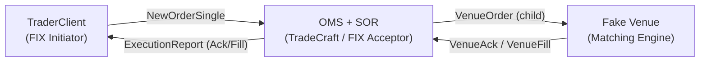

# TradeCraft – OMS + SOR + Trader Demo

TradeCraft is a minimal simulation of an **Order Management System (OMS)**,  
**Smart Order Router (SOR)**, and **Venue simulator**, built in Java 21 with QuickFIX/J.  
This MVP demonstrates how FIX messages flow between a Trader and OMS, and how orders  
are acknowledged and filled inside a simulated venue.

---

## 🚀 MVP Features
- **FIX 4.4 connectivity** (QuickFIX/J acceptor & initiator with `acceptor.cfg` / `initiator.cfg`)
- **Parent/Child order model** with FSM lifecycle (`NEW → ACK → FILL`)
- **Venue simulator** executes demo trades as *single full fills* (no partials yet)
- **Demo trades** bundled in `resources/trades-actions.csv`:
    - One **limit order** (`LMT @ 200.5`)
    - One **market order** (`MKT`)

---

## ❌ Not in MVP-1
- Cancel / Replace flows (`FIX 35=F/G`)
- Partial fills or multi-leg matching
- Idempotency of duplicate FIX messages
- Complex order types (IOC, FOK, GTD)
- Production-grade risk checks or persistence

These are all candidates for **future extensions**.

---

## 📊 Architecture Overview



**Flow Summary:**
1. Trader sends NewOrderSingle.
2. OMS ingests → SOR routes to Venue.
3. Venue responds with Ack / Fill.
4. OMS updates state → Trader receives ExecutionReport.

---

## 🔧 Build & Run

Requirements:
- Java 21+
- Gradle 8+ (wrapper included)

Compile & test:
```bash
./gradlew clean build
```

Run demo (use two terminals):

**Terminal 1 – OMS + Venue**
```bash
./gradlew runBootstrap
```

**Terminal 2 – Trader**
```bash
./gradlew runTrader
```

The Trader automatically loads demo trades from `resources/trades-actions.csv`.

---

## 📊 Sample Output

**Condensed flow across components**

```text
[TRADER][EV][OUT] NewOrderSingle CL1 LMT@200.5
[OMS][EV][IN] EvNew ... side=BUY, qty=1000, ordType=LIMIT
[SOR][EV][IN] VenueAck childId=... venueId=SIM
[OMS][EV][IN] EvChildAck status=ACK
[SOR][EV][IN] VenueFill lastQty=1000 lastPx=200.50
[OMS][EV][IN] EvChildFill status=FILLED cum=1000
[TRADER][EV][IN] ExecReport Ack (NEW)
[TRADER][EV][IN] ExecReport Fill (FILLED) cum=1000 last=1000@200.5
```

---

### 🔍 Full Log Trace (Technical Detail)

<details>
<summary>Click to expand</summary>

```text
# Session up
2025-09-20T12:30:11,183 INFO q.event - FIX.4.4:OMS->TRADER: Logon contains ResetSeqNumFlag=Y
2025-09-20T12:30:11,219 INFO i.t.f.s.OmsFixInbound - Logon: (sid=FIX.4.4:OMS->TRADER)

# CL1: LIMIT 1000 @ 200.50
2025-09-20T12:30:11,351 [OMS][EV][IN] EvBoundParentNew ... clOrdId=CL1 ... LIMIT ... 200500000
2025-09-20T12:30:11,475 [TRADER][EV][IN] ER clOrdId=CL1 ... execType=0 ordStatus=0 ... leaves=1000   # Ack/New
2025-09-20T12:30:11,484 [SOR][EV][IN] VenueFill ... lastQty=1000 lastPxMicros=200500000 isFinal=true
2025-09-20T12:30:11,492 [OMS][EV][IN] EvChildFill ... cumQty=1000 isFinal=true
2025-09-20T12:30:11,499 [TRADER][EV][IN] ER clOrdId=CL1 ... execType=2 ordStatus=2 last=1000@200.5000 cum=1000 leaves=0   # Filled

# CL2: MARKET 1000
2025-09-20T12:30:11,402 [OMS][EV][IN] EvBoundParentNew ... clOrdId=CL2 ... MARKET
2025-09-20T12:30:11,476 [TRADER][EV][IN] ER clOrdId=CL2 ... execType=0 ordStatus=0 ... leaves=1000   # Ack/New
2025-09-20T12:30:11,485 [SOR][EV][IN] VenueFill ... lastQty=1000 lastPxMicros=200010000 isFinal=true
2025-09-20T12:30:11,497 [TRADER][EV][IN] ER clOrdId=CL2 ... execType=2 ordStatus=2 last=1000@200.0100 cum=1000 leaves=0   # Filled
```

</details>

---

## 🗂️ Project Structure
```
tradecraft/
 ├─ src/main/java/io/tradecraft/bootstrap    # OMS + SOR entrypoint (TradeCraft.java)
 ├─ src/main/java/io/tradecraft/trader       # Trader client (TraderClient.java)
 ├─ src/main/java/io/tradecraft/common       # Domain model & utilities
 ├─ src/main/java/io/tradecraft/fixqfj       # FIX/QuickFIX-J integration
 ├─ src/main/java/io/tradecraft/oms          # OMS core (FSM, runtime)
 ├─ src/main/resources/
 │    ├─ log4j2.xml                          # Logging config
 │    ├─ trades-actions.csv                  # Demo orders (limit + market)
 │    ├─ quickfix/acceptor.cfg               # OMS FIX acceptor
 │    └─ quickfix/initiator.cfg              # Trader FIX initiator
 └─ build.gradle.kts
```

---

## 🧪 Tests
Run unit tests:
```bash
./gradlew test
```

Examples:
- `OmsFixServerTest`
- `ParentOrderFsmApplyEffectsTest`
- `PipelineRunTest`

---

## 📈 Future Work
- Add Cancel / Replace flows
- Implement idempotency checks (`seenCmd`, `seenExec`)
- Support IOC / FOK / GTD order types
- Simulate partial fills and multi-order book depth
- Metrics with Micrometer / Prometheus

---

## 📜 License
Educational / demo purposes only. Not production-ready trading code.
