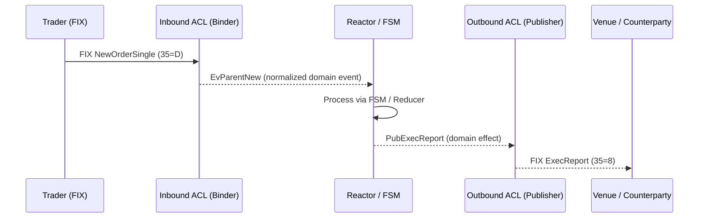

# 🧱 The Story of the Anti-Corruption Layer
*A tale of translators, guardians, and order in the city of TradeCraft*

---

## Act I — The City and the Gate

TradeCraft is a bustling city where every event is precious and every order has purpose.  
But beyond its walls lies a noisy world — foreign dialects of **FIX**, **venue quirks**, and **legacy enums** whispering half-truths.

To protect the city, engineers built a **Gate** called the **Anti-Corruption Layer (ACL)**.  
Its duty: **translate foreign speech into the city’s clean tongue** — the **domain language** of `Ev*` events — and ensure no outside impurity slips through.

This gate has **two faces**:

1. **Inbound ACL (Binder)** – interprets what outsiders say when they send messages *in*.
2. **Outbound ACL (Publisher)** – rewrites what the city says before sending messages *out*.

---

## Act II — The Inbound Binder

When a trader’s FIX message arrives —  
`35=D`, `11=CL1`, `55=AAPL`, `38=1000`, `44=199.5` —  
it is untrusted, unnormalized, maybe even malformed.

At the **Gate of Entry**, the **Binder** reads it carefully:

- **Translates** from FIX into the domain event `EvParentNew`
- **Normalizes** values (price → micros, time → nanos, enums → DomainSide)
- **Validates** price bands, account rules
- **Dedupes** repeated ClOrdIDs
- **Enriches** with domain IDs (`ParentId`, `InstrumentKey`)

Only then does it place the purified message into the **Event Queue**, where the **Reactor** takes over.

---

## Act III — The Reactor: The City’s Traffic Cop

Inside the city walls, everything follows a **deterministic rhythm**.

The **Reactor pattern** drives the flow — a **single-threaded event loop** that ensures strict ordering and causality.  
It never parses FIX or performs I/O; it just consumes clean, typed domain events from the Binder.



The Reactor demultiplexes by `ParentId` or `ChildId`, dispatches to the correct FSM,  
and produces **Effects** — outcomes like `PubExecReport`, `NewChildCmd`, or `VenueCancelCmd`.

---

## Act IV — The Outbound Publisher

Now it’s time for the city to reply.

The **Outbound ACL**, known as the **Publisher**, polishes those internal Effects into messages the outside world can understand.

It:
- Converts domain enums into FIX tags (`DomainExecType → 35=8 150=F`)
- **Rounds** micros back to proper decimals
- **Maps errors** (`PRICE_BAND → OrdRejReason=99 Text="Fat Finger"`)
- **Splits** partial fills into multiple ExecReports
- **Maintains** sequence integrity (`ClOrdID`, `ExecID`, `OrderID`)

The Publisher ensures that, no matter what dialect or version of FIX the counterparty speaks,  
TradeCraft’s response remains consistent and compliant.

---

## Act V — The Harmony of Boundaries

Together, Binder + Reactor + Publisher form a **closed loop** of clarity:

```
Inbound ACL (Binder) → Reactor → FSM → Effects → Outbound ACL (Publisher)
```

Each plays a role:
- **Binder** guards the *entry*: cleans and translates.
- **Reactor** governs the *flow*: orders and dispatches.
- **Publisher** refines the *exit*: formats and communicates.

---

## Act VI — Why the Guardians Matter

| Benefit | Story Meaning |
|----------|----------------|
| **Purity of the City** | No FIX tags or messy data pollute FSMs |
| **Adaptability** | The city can trade via REST or gRPC tomorrow; the walls stand |
| **Replayability** | Both raw and clean events are stored for perfect audit |
| **Testability** | The city’s logic runs without real FIX sessions |
| **Resilience** | When external protocols evolve, only the gates need repair |

---

## Act VII — Guiding Principles

> Lock on identity, not on process.  
> Translate at the edge, not in the core.  
> Let the Reactor rule the city, and let the Gates speak every foreign tongue.

---

## Epilogue

In TradeCraft, the **Anti-Corruption Layer** is not just a pattern —  
it’s a philosophy of *respecting boundaries*.

The **Binder** and **Publisher** are translators and guardians;  
the **Reactor** is the clockwork heart that keeps the city moving in order.

Together they form a timeless structure:

> **Clean domain inside, chaos outside — harmony through translation.**
