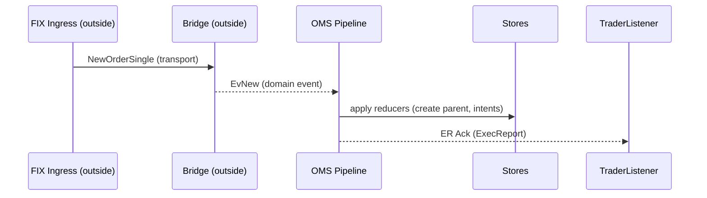

# README — Pipeline Reactor (app/PipelineModule & oms/Pipeline)

> **Scope:** This README explains the architecture and runtime role of the `Pipeline` reactor used in TradeCraft — both in `app/PipelineModule` and `oms/Pipeline`.

---

## 1. Overview

The **Pipeline** is a **single-threaded reactor** that processes **inbound domain events** (e.g., `EvBound*`, `SorEvent*`) and emits **outbound domain events** (ER, Cmd, logs). It sits at the **core of OMS execution** and ensures deterministic causality and safe concurrency boundaries.

```
[Upstream (Ingress/Map/Bridge)] --(EvBound*, SorEvent*)--> [Pipeline Reactor]
                                             |                 |
                                             v                 v
                                       [Reducers/Stores]   [Outbound: ER, Cmd]
```

### What Pipeline Is Not
- It **does not** perform FIX ingestion, binding, or mapping.
- It **does not** transform transport messages.
- It **only** consumes already-domain-normalized events.

---

## 2. Responsibilities

| Component | AppliesTo | Decides |
|---|---|---|
| **Upstream Ingress/Map/Bridge** | FIX transport, mapping | Not part of pipeline |
| **Pipeline Reactor** | inbound `OrderEvent` stream, state stores | Business state transitions & effect lists |
| **Effects Dispatch** | ER/Cmd routing to listeners/routers | destination queues & guarantees |
| **PipelineModule** | thread, guard, meters, queue sizes | capacity/backpressure policy |

**Rule of thumb:** Reducers **decide**, the rest **applies**. The pipeline **hosts** reducers and drives their execution.

---

## 3. `app/PipelineModule`

Responsible for wiring and runtime configuration:

- **Inbound bus:** single `EventQueue<OrderEvent>` already containing domain events.
- **Outbound sinks:** listeners (Trader, SOR, VenueRouter) or queues.
- **Threading:** spawns the **single reactor thread** with `ThreadGuard`.
- **Stores:** injects repositories and FSMs (`ParentOrderFsmRepo`, `ChildStateStore`).
- **Allocators:** ID and time sources (`ParentIdAllocator`, `DualTimeSource`).
- **Meters:** queue depths, latency, and event counters.

**Decides:** threading, backpressure, and fairness policy.

---

## 4. `oms/Pipeline`

### Core responsibilities
1. **Drain inbound queue** of `EvBound*` and `SorEvent*`.
2. **Apply reducers** (Parent/Child FSM, intent handlers) → update stores & generate effects.
3. **Dispatch effects:**
   - `EvAck`, `EvFill`, `EvCancelAck` → Trader listener
   - `CmdNewChild`, `CmdCancelChild` → SOR or VenueRouter
4. **Maintain cancel semantics:** via helpers like `ParentCancelRegistry` and `DefaultClOrdIndex`.

### Reducers
- Deterministic pure functions: `State × Event → State × Effects`
- Produce **effects** executed outside reducers to preserve determinism.

---

## 5. Event Taxonomy (from pipeline’s perspective)

| Direction | Type Examples                                                                          |
|---|----------------------------------------------------------------------------------------|
| **Inbound (domain)** | `EvNew`, `EvCancelReq`, `EvReplaceReq`, `EvChildAck`, `EvAck`, `EvFill`, `EvCancelAck` |
| **Outbound** | `NewChildCmd`, `CancelChildCmd`, `PubExecReport`                                        |

*Transport-specific types (e.g., `FixEv*`) never enter the pipeline.*

---

## 6. Reactor Loop (simplified pseudocode)

```java
while (running) {
  int n = inbound.drainTo(buf, batchSize);
  for (int i = 0; i < n; i++) {
    var ev = buf[i]; // EvBound* or SorEvent*
    var effects = reducers.apply(ev, stores, allocators, time);
    for (var e : effects) dispatch(e); // ER, Cmd, metrics
  }
  yieldStrategy.idle(n);
}
```

---

## 7. Sequence Example



---

## 8. Backpressure & Fairness

- Bounded inbound queue; policy = **drop-with-metric** to avoid blocking network threads.
- ER output may **block short** or use **overflow journal** if listener slows.
- Round-robin fairness between sources if multiple inbound producers exist.

---

## 9. Idempotency & Cancel Registry

### `ParentCancelRegistry`
Tracks cancel propagation inside the pipeline:
- `mark(parent)` when cancel requested.
- `markChildIfFirst(parent, child)` returns true once per pair (one cancel per child).
- `clear(parent)` after full cancel completion.

Ensures **no duplicate cancel commands** per child.

---

## 10. Metrics & Determinism

- `queue.depth`, `loop.latency`, `er.emitted.count`
- Deterministic replay via `DualTimeSource` (event vs wall time).
- Locking principle: **lock by identity, not subsystem.**

| Module | Identity Lock |
|---|---|
| OMS | ParentId |
| SOR | ChildId / ParentId stripe |
| Venue | InstrumentKey |

---

## 11. Known Gaps / Next Tier

- Full Cancel/Replace reducer flow.
- Replay harness & latency measurement.
- CommandId deduplication at venue boundary.
- Overflow handling for slow ER listener.
- Extended metrics by event type.

---

### Summary
**Pipeline** = deterministic reactor loop.
It is the **heartbeat** of OMS — turning normalized inbound events into well-formed outbound decisions under a single-threaded, traceable execution model.

*End of README.*

