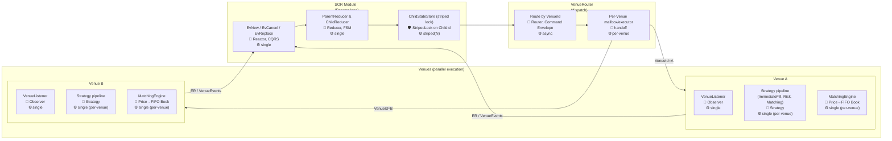
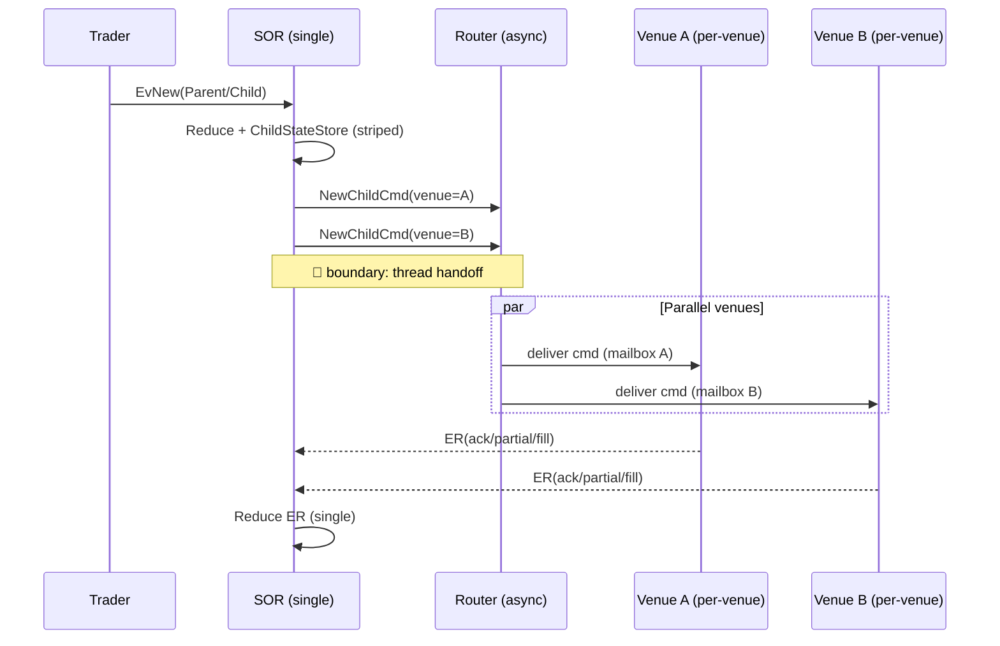

# SOR → VenueRouter → Venue — Concurrency Flow

---

## Legend

- ⚙️ **Thread Model**: `single` · `striped(N)` · `per-venue` · `pool(M)` · `async`
- 🧩 **Pattern**: Reactor · CQRS · Command Envelope · Strategy · Observer · Idempotency · Value Object
- 🔄 **Boundary**: a *handoff* where ownership passes from one thread/executor to another
- 🛡 **Guard**: thread/stripe key or invariant protecting serialization
- 🧵 **Stripe Key**: `ParentId` · `ChildId` · `VenueId`

> **Annotation template** (paste into any node’s note/markdown):
>
> - ⚙️ Thread: `single | striped(N) | per-venue | pool(M) | async`
> - 🧩 Pattern(s): `…`
> - 🛡 Guard: `…`
> - 🔑 Stripe key: `…`
> - 📦 Idempotency window: `…`
> - 📚 State store(s): `…`
> - ⏱ Time source: `DualTimeSource` (event vs wall)

---
> **Multiple Venues**
> 
> [SOR Router]
> 
> ├─▶ [Venue-NYSE Thread]
> 
> ├─▶ [Venue-ARCA Thread]
> 
> └─▶ [Venue-NASDAQ Thread]

## High-Level Flow (Mermaid)



**Reading guide**
- **SOR**: currently single-threaded main loop + reducers. `ChildStateStore` uses **striped locking** by `ChildId` for safe updates where parallelism is allowed across stripes.
- **VenueRouter**: **handoff boundary** 🔄 from SOR thread to a **per‑venue executor** (mailbox). This serializes commands *within a venue* while allowing **parallelism across venues**.
- **Venue** internals: kept **serialized per venue** to maintain book determinism. Strategies run in-order inside the venue thread.

---

## Concurrency Boundaries (where threads change hands)

1. **SOR → VenueRouter**: enqueue/dispatch by `VenueId` (🔄). Back‑pressure via bounded queues recommended.
2. **Router → Venue(Executor)**: per‑venue mailbox ensures *intra‑venue* serialization.
3. **Venue → SOR** (events): ER/VenueEvents flow back onto the SOR’s reactor thread (or a dedicated intake with a single consumer), restoring single‑threaded state mutation semantics on SOR side.

---

## ASCII Fallback (no Mermaid)

```
[SOR: Reactor single]
  └─> [Reducers single]
       └─> [ChildStateStore striped(N) by ChildId]
             └─(🔄 handoff)─> [VenueRouter async]
                               └─(per‑venue mailbox)─> [Venue A single]
                               └─(per‑venue mailbox)─> [Venue B single]

[Venue A single] ──ER/VenueEvents──> [SOR intake single]
[Venue B single] ───────────────────> [SOR intake single]
```

---

## Sequence View — Parallel Venues



---

## AppliesTo / Decides Matrix (Strategies & Rules)

| Layer | Component | appliesTo | decides | Thread model |
|---|---|---|---|---|
| SOR | ChildStateStore | ChildId (stripe) | child state transitions | striped(N)
| SOR | ParentReducer/ChildReducer | Parent/Child intents | state evolution, routing intent | single
| Router | VenueRouter | VenueId | venue dispatch | async → per‑venue
| Venue | FatFingerRiskStrategy | Order, NBBO snapshot | reject/band price | single (per‑venue)
| Venue | ImmediateFillStrategy | Order vs book/NBBO | immediate cross, IOC handling | single (per‑venue)
| Venue | MatchingEngine | Book by Instrument | match (Price→FIFO) | single (per‑venue)
| Venue | VenueListener | Exec/VenueEvents | emit events upstream | single (per‑venue)

> Tip: If you later add **NBBOProvider** as an external reactor, annotate it with `appliesTo = InstrumentKey` and `decides = price bands, crossability`.

---

## Current vs Scalable Configurations

- **Current (your code today)**
  - SOR main loop + reducers: **single**
  - `DefaultChildStateStore`: **striped(N)** via StripedLock keyed by `ChildId`
  - VenueRouter: async dispatch to **per‑venue** executors
  - Each Venue: **serialized** (deterministic book)

- **Scalable (drop‑in evolution)**
  - Keep SOR reducers single-threaded; widen *ingress* with a single-consumer ring buffer (LMAX style) if needed.
  - Increase `N` stripes in `ChildStateStore` (measure contention vs false sharing).
  - Route by `(VenueId, InstrumentKey)` only if each venue hosts many independent books and you accept per‑instrument serialization (advanced).
  - Add back‑pressure metrics on mailboxes; shed load with idempotency on replays.

---

## Checklists

### Box Annotations (fill these in per component)
- ⚙️ Thread:
- 🧩 Pattern(s):
- 🛡 Guard:
- 🔑 Stripe key:
- 📦 Idempotency window:
- 📚 State store(s):
- ⏱ Time source:

### Concurrency Safety
- [ ] All cross-thread paths have **CommandId/ExecId** to ensure idempotent replays
- [ ] Each handoff 🔄 is **bounded** and **metered** (queue size, lag)
- [ ] Venue side is **deterministic** given same event/time seeds
- [ ] ER path to SOR is **single-consumer** before reducers mutate state

---

## How to Use in IntelliJ

- IntelliJ Markdown preview supports Mermaid in recent versions. If not, use the **ASCII fallback** above.
- To export diagrams as images, open the Mermaid code block in a Mermaid-enabled preview and use *Copy Image*.

---

## Notes & Assumptions

- Reflects your current design: SOR single-threaded; `DefaultChildStateStore` uses **striped locks**; venues are **serialized per venue**; venueRouter enables **parallel across venues**.
- Update the matrix and box annotations as you evolve (e.g., adding NBBO reactor, venue-side risk batching, or per-instrument executors).

