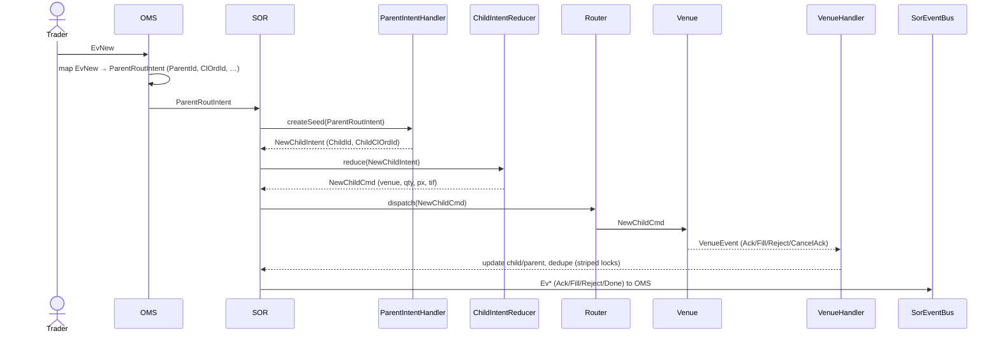

# 🧭 Smart Order Router (SOR) — Design & Story

> **Status:** Minimal market-context SOR (no NBBO/risk yet) with explicit `VenueHandler` and striped locking in `DefaultChildStateStore`.

---

## Overview

The **Smart Order Router (SOR)** coordinates between the OMS and Venues.  
It **does not** match or price orders; it transforms routed parent instructions into executable child commands, monitors venue feedback, and emits clean, trader‑facing events back to the OMS.

At this stage, the SOR:
- Handles parent‑to‑child seeding (`ParentRouteIntent` → `NewChildIntent`)
- Reduces to executable `NewChildCmd` and dispatches via a **Router** to **VenueGateway**
- Processes venue feedback through a dedicated **`VenueHandler`**
- Emits **`Ev*`** events (Ack, Fill, Reject, Done, etc.) to the OMS via **`SorEventBus`**
- Uses **striped locks** in **`DefaultChildStateStore`** for per‑key concurrency control

---

## 🏁 Act I — The Call (OMS Domain)

**Trader → OMS:** `EvNew`

OMS receives the trader’s order, allocates a **`ParentId`**, carries the trader’s **`ClOrdId`**, and maps it into a **`ParentRouteIntent`** — the official routed mission.

> “HQ receives the mission and issues a routing intent with identifiers and objectives defined.”

**appliesTo:** `EvNew`  
**decides:** `ParentRouteIntent { ParentId, ClOrdId, side, qty, ordType, tif, price, instrument }`

---

## 🧩 Act II — The First Child (SOR Domain)

**OMS → SOR:** `ParentRouteIntent`

Inside SOR, the **ParentIntentHandler**:
- Allocates **`ChildId`** and stable **`ChildClOrdId`**
- Packs them into a **`NewChildIntent`** (the seed of execution)

> “Name the scout and hand them their sealed orders — the first child intent is born.”

**appliesTo:** `ParentRouteIntent`  
**decides:** `ChildId`, `ChildClOrdId`, `NewChildIntent`

---

## 🧮 Act III — Dispatch and Routing

The **ChildIntentReducer** transforms `NewChildIntent` into one or more **`NewChildCmd`** records (venue, qty, price, tif).  
Each command is dispatched through the **Router**, which resolves and invokes the appropriate **Venue** by `VenueId`.

> “The Router chooses the path to each venue.”

**appliesTo:** `NewChildIntent`  
**decides:** `NewChildCmd` (venue, qty, px/tif)

---

## 📬 Act IV — Venue Responses (VenueHandler)

Venues respond asynchronously with **`VenueEvent`** variants:
- `VenueAck`, `VenueFill` (partial/full), `VenueReject`, `VenueCancelAck` / `VenueCancelReject`

The **`VenueHandler`**:
- Updates **`DefaultChildStateStore`** (per‑child state) using **striped locks** for safe, low‑contention updates
- Aggregates to parent (cumQty, leavesQty, avgPx, status)
- Ensures **idempotency** (dedupe on `(ChildId, VenueOrderId, ExecId)`)
- Emits the appropriate **`Ev*`** via **`SorEventBus`**

> “The VenueHandler is the post office — collecting responses, updating records, and forwarding the trader’s truth.”

---

## 🧭 Act V — Reporting Back to OMS

As state evolves, SOR publishes **`Ev*`** events:
- `EvAck`, `EvFill`, `EvPartialFill`, `EvReject`, `EvCancelAck`, `EvDone`, …

These are the trader‑visible truth, ordered and idempotent.

---

## 🔁 Message Sequence



---

## 🧩 appliesTo / decides Summary

| Component | appliesTo | decides | Description |
|---|---|---|---|
| **OMS Mapper** | `EvNew` | `ParentRoutIntent` | Maps trader request to routed parent mission |
| **ParentIntentHandler (SOR)** | `ParentRoutIntent` | `ChildId`, `ChildClOrdId`, `NewChildIntent` | Seeds execution with unique child |
| **ChildIntentReducer (SOR)** | `NewChildIntent` | `NewChildCmd` | Creates executable venue commands |
| **Router (SOR)** | `NewChildCmd` | `VenueGateway` | Connects to target venue |
| **VenueHandler (SOR)** | `VenueEvent` | updates state, emits `Ev*` | Handles venue feedback (uses striped locks in `DefaultChildStateStore`) |
| **SorEventBus (SOR)** | state transitions | `Ev*` | Publishes trader‑facing events |

---

## ⚙️ Patterns Used

| Category | Pattern | Where / Why |
|---|---|---|
| **Architecture** | **Hexagonal / Ports & Adapters** | Router + VenueGateway isolate SOR from venue specifics |
| **Processing** | **CQRS** | Commands (`NewChildCmd`) vs event streams (`Ev*`) and state stores |
| **Domain Flow** | **Intent–Reducer Pattern** | `ParentIntentHandler`, `ChildIntentReducer` |
| **Messaging** | **Event Bus / Observer** | `SorEventBus` for outbound, venue → SOR via `VenueHandler` |
| **Concurrency** | **Striped Lock** | `DefaultChildStateStore` per‑key locking with high throughput |
| **Idempotency** | **Command ID + Event ID Chain** | Dedupe venue acks/fills; stable `ChildClOrdId` |
| **Aggregation** | **Reducer + Aggregate** | Parent summarizes child outcomes |
| **Identity** | **Identity Pattern** | `ParentId` → `ChildId` → `VenueOrderId` → `ExecId` traceability |

---

## 🧠 Current Constraints (By Design)

- **No NBBO / risk context yet**: routing is static or pre‑configured.
- **`ParentCtxStore` minimally used**: currently a placeholder; not required for core flow.

---

## 🚀 Enhancements (Optional, Future‑Ready)

> These do **not** change today’s flow; they can be added incrementally.

1. **Dynamic Routing (NBBO‑aware):** enrich a `CtxStore` with market snapshots (best price / spread / venue depth) to choose destinations adaptively.
2. **Adaptive Re‑Routing:** use recent venue feedback (latency, reject rate, fill ratio) to revise leaves.
3. **Cross‑Venue Throttling / Back‑Pressure:** per‑venue rate limits and retry policies in the Router.
4. **Risk‑Aware Pre‑Checks:** fat‑finger bands or exposure caps before dispatch (Guard/Policy pattern).
5. **ParentCtxStore Evolution:** cache per‑parent strategy state (timebox, retry budget, last venue tried) to make retries deterministic.

---

## 🔒 Concurrency & Idempotency Notes

- **Striped locks** in `DefaultChildStateStore`: shard keys (e.g., `ParentId`/`ChildId`) across lock stripes to minimize contention and preserve per‑entity atomicity.
- **Idempotency keys**:
    - Commands: `ChildClOrdId` (optionally `CommandId`)
    - Venue linkage: `VenueOrderId`
    - Exec dedupe: `ExecId`
- **Replay safety**: reprocessing `VenueEvent`s must not change totals; re‑ingesting `ParentRoutIntent` must not spawn duplicate seeds.

---

## 🧩 One‑Line Summary

> **EvNew** (trader → OMS) → **ParentRoutIntent** (OMS → SOR) → **ParentIntentHandler** spawns **NewChildIntent** (with `ChildId`) → **ChildIntentReducer** creates **NewChildCmd** → **Router** dispatches → **VenueHandler** processes **VenueEvents** → **SorEventBus** emits **`Ev*`** back to OMS — with per‑entity safety via **striped locks** in `DefaultChildStateStore`.

---

## 📁 Suggested Placement

```
io.tradecraft.sor/
 ├── handler/
 │    └── VenueHandler.java
 ├── intent/
 ├── reducer/
 ├── venueRouter/
 ├── store/
 │    └── DefaultChildStateStore.java   # uses striped locking
 ├── bus/
 └── README.md   ← (this file)
```
